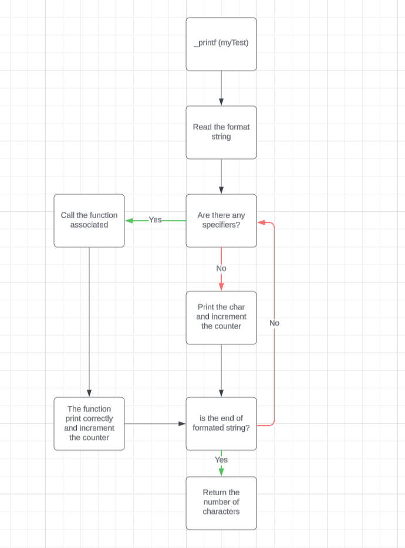

# BascoPrintf

This directory contains my interpretation of the printf command.

## Contenu

**main.h** : Header file linking all files together.

**myprintf.c** : Main trunk of my printf function.

**_putchar.c** : Writes characters to standard output.

**print_address.c** : Prints addresses..

**print_char.c** : Prints characters.

**print_hexa_maxi.c** : Prints numbers in hexadecimal and uppercase.

**print_hexa_mini.c** : Prints numbers in hexadecimal and lowercase.

**print_int.c** : Prints digits.

**print_octal.c** : Prints octal values.

**print_percent.c** : Prints the '%' symbol.

**print_unsigned_int.c** : Prints unsigned digits.

**print_string.c** : Prints strings.

**README.md** : You are currently reading it.

**main.c** : My tests.

## Flowchart

.

## Prerequisites

To compile and run these programs, you'll need a C compiler (e.g. gcc).

## Compiling and executing

To compile and execute this program, use the following command:
```bash
git clone https://github.com/Basco64/holbertonschool-low_level_programming.git
```
```
cd holbertonschool-low_level_programming/testBasco
```
```
gcc *.c -o prog && ./prog
```

## Examples

Displaying a string : 

Source code :
```c
#include "main.h"

int main() {
    _printf("String:[%s]\n", "I am a string !");
    return 0;
}
```

Expected release:

```
String:[I am a string !]
```

Several tests are performed in the **main.c** file, but you can have fun performing many more like that:

```c
#include "main.h"

int main() {
    int num = 5;
    char* str = "cumulonimbus";
    char* adjective = "magnificient";

    _printf("I see %d %s %s in the sky !", num, adjective, str);

    return 0;
}
```

Expected release:

```
I see 5 magnificent cumulonimbus in the sky !
```


## Author

This project was created by Basco64 for the Holberton School.


## License

This project is licensed under the MIT license.

## Acknowledgements
Thanks to Holberton School for their support.
